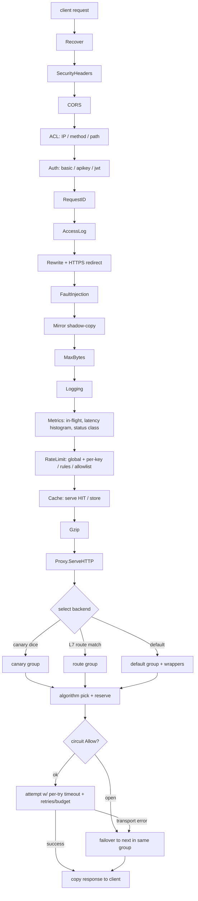

# Architecture

## Component overview

```
                        ┌──────────────────────── admin plane (loopback / :9090, bearer-auth) ─────────┐
                        │  /metrics  /metrics.json  /healthz  /readyz  /reload  /admin/*  /debug/pprof  │
                        └───────────────────────────────────────────────────────────────────────────────┘
 client ── data plane (:8080) ─►  http.Server ─► middleware chain ─► Proxy ─► balancer ─► upstream backends
                                                                       │            │
                                                       circuit breaker ┘   health checker / discovery
```

## Request flow (data plane)

The middleware chain is assembled outer→inner in `server.setupHTTPServer`. Each
middleware is installed only when its config block is enabled.



## Backend selection & resilience

- **Groups.** Requests resolve to exactly one balancer *group* — canary (weighted
  dice), an L7 route match, or the default group — pinned on the request context so
  selection, failover, sticky affinity, and latency/outcome observers all stay within
  that group (no cross-group leakage).
- **Reserve-on-select.** `Next()`/`NextForKey()` increments the chosen backend's
  in-flight count; the proxy releases it when the request completes.
- **Wrappers** (default group) compose lock-free by narrowing the candidate set:
  `OutlierDetection(SlowStart(ZoneAware(PriorityTiers(baseAlgorithm))))`.
- **Failover** stays within the group, respects `MaxConns` (bulkhead), and — for
  non-idempotent methods — only replays on a pure connection error.
- **Circuit breaker** (consecutive or rolling-window) gates each attempt and feeds a
  state-change hook (logs + `rplb_backend_circuit_state` gauge).

## Concurrency & correctness notes

- Backend health is an `atomic.Bool`; `reloadConfig` is serialized by `reloadMu`; the
  logger guards level/format under its mutex (live-reload safe).
- Live reload diffs backends by URL and mutates the balancer under lock; DNS discovery
  only manages the backends it created.
- Response cache, rate-limiter maps, and metrics are mutex/atomic guarded and bounded.

## Packages

See the layout table in the [README](../README.md#project-layout).
