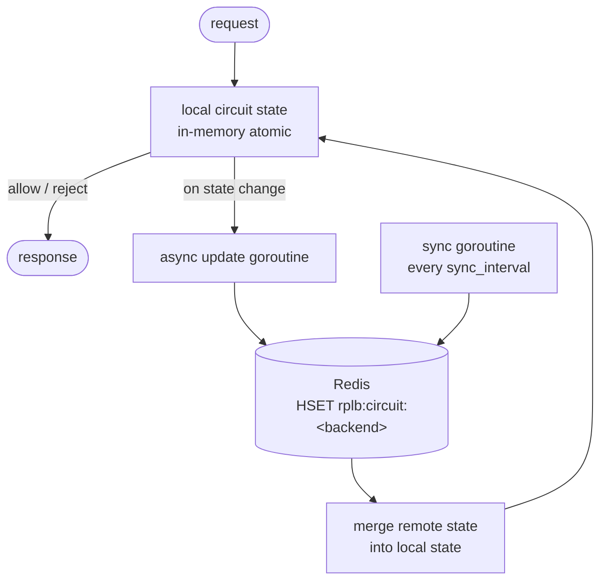

# ADR-003: Local-First Distributed Circuit Breaker via Redis

**Status:** Accepted  
**Date:** 2026-07-18  
**Deciders:** sanskarpan  

---

## Context

In a multi-instance deployment (3–10 rplb replicas behind a cloud load balancer), each instance runs its own circuit breaker independently. This creates a split-brain problem:

**Scenario:**

1. 10 rplb replicas, each sending traffic to backend B.
2. Backend B starts failing.
3. Each replica counts failures independently.
4. Replica 1 reaches `failure_threshold=5` first and opens its circuit.
5. Traffic from replica 1 stops hitting B, so replica 1's failure count stops growing.
6. Replicas 2–10 have seen only 2–4 failures each (because some of their requests also hit B between replica 1's retries and their own).
7. Replicas 2–10 continue sending traffic to the failing B for several more seconds.

With 10 replicas and `failure_threshold=5`, the backend receives up to 49 failures (5 × 10 - 1) before all circuits open. This is 10× worse than a single-instance deployment.

---

## Requirements

1. **Correctness:** Circuit state must converge across replicas within a reasonable window (< 2 seconds).
2. **Performance:** No Redis round-trip on the hot path. Every request must make a local decision.
3. **Resilience:** If Redis is unavailable, the circuit breaker must continue functioning with local state.
4. **Simplicity:** No distributed consensus protocol, no leader election.

---

## Decision

**Local-first with asynchronous Redis sync.**

### Architecture



### State representation in Redis

```
HSET rplb:circuit:http://b1:8000
  state       "open"
  failures    "5"
  last_trip   "1753093200"
  instance_id "proxy-3"
```

Each instance writes its own state under its instance ID. The merge function takes the **most pessimistic** state:
- If any instance reports `open`, the merged state is `open`.
- Failure counts are summed across instances.
- `last_trip` is the maximum (most recent).

### Merge logic

```go
func mergeStates(local *CircuitState, remote map[string]*CircuitState) *CircuitState {
    merged := local.Copy()
    for _, r := range remote {
        if r.State == Open && merged.State != Open {
            merged.State = Open
            merged.LastTrip = r.LastTrip
        }
        merged.Failures += r.Failures
    }
    return merged
}
```

### Configuration

```yaml
circuit_breaker:
  enabled: true
  mode: consecutive
  failure_threshold: 5
  success_threshold: 2
  timeout: 30s

  redis:
    enabled: true
    addr: "redis:6379"
    password: "${REDIS_PASSWORD}"
    db: 0
    key_prefix: "rplb:circuit:"
    sync_interval: 1s
    write_timeout: 100ms
```

| Field | Type | Default | Description |
|-------|------|---------|-------------|
| `redis.enabled` | bool | `false` | Enable Redis state sync |
| `redis.sync_interval` | duration | `1s` | How often to pull remote state |
| `redis.write_timeout` | duration | `100ms` | Redis write timeout (async — does not block request path) |

---

## Alternatives considered

### Alternative 1: Fully centralized circuit breaker in Redis

All circuit state lives in Redis. Every request makes a Redis read to check if the circuit is open.

Rejected because:
- A Redis round-trip (typically 0.5–2 ms) on every request doubles or triples latency for fast backends (sub-5ms latency).
- Redis becoming slow or unavailable would cause all requests to hang waiting for circuit checks.
- Violates requirement 2 (no Redis on hot path) and requirement 3 (resilience to Redis unavailability).

### Alternative 2: Gossip protocol (memberlist, serf)

Instances gossip circuit state changes directly without Redis.

Rejected because:
- Requires a service discovery mechanism for instances to find each other.
- Gossip convergence time (typically 100–500ms for small clusters) is acceptable but adds operational complexity.
- Redis is already a dependency for distributed rate limiting — reusing it avoids introducing a new component.

### Alternative 3: Shared nothing (current independent behavior)

Each instance has its own circuit breaker with no coordination.

Rejected as the baseline we are improving on. The split-brain problem means multi-instance deployments tolerate 10× more failures than single-instance before all circuits open.

### Alternative 4: Pub/Sub for immediate propagation

When an instance opens a circuit, publish to a Redis pub/sub channel. Other instances subscribe and open immediately.

Considered as a future enhancement. The current pull model (periodic sync) is simpler and sufficient for most workloads. Push-based sync would reduce convergence time from `sync_interval` (1s) to the pub/sub round-trip (~5ms), which matters for very high failure rates.

---

## Consequences

**Positive:**
- Zero Redis latency on the hot path — all decisions are local.
- Redis failure is graceful — instances continue with local state.
- Convergence time is bounded by `sync_interval` (default 1 second), which is sufficient for circuit breaker use cases (failures accumulate over seconds, not milliseconds).
- Multi-instance deployments see the full aggregate failure rate, not per-instance fragments.

**Negative:**
- Convergence is eventual, not immediate. In the 1-second sync window, instances may disagree on circuit state.
- The merge function is eventually consistent but not linearizable — a brief window exists where an instance that opened its circuit locally might close it based on stale remote state.
- The Redis key TTL must be tuned to prevent stale state from very old instances (crashed replicas) from keeping circuits open indefinitely. Set Redis key expiry to `timeout + sync_interval + 10s`.
- Testing distributed behavior requires a running Redis instance (tests are skipped when Redis is unavailable — see `CONTRIBUTING.md`).
